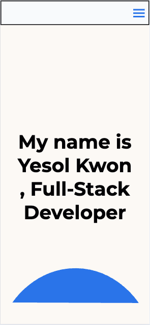
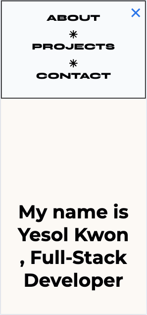
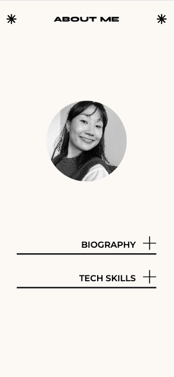
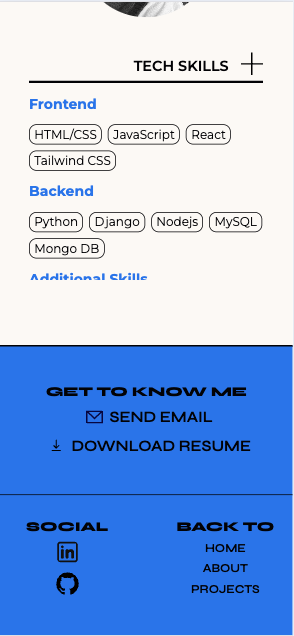
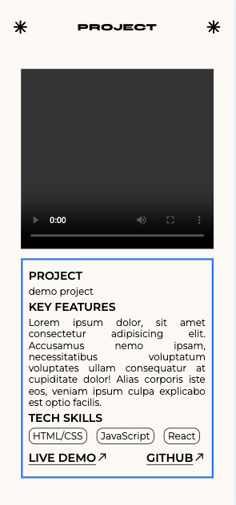

# Yesol Kwon - Portfolio Task

​
[My portfolio site](https://yeskwonny.github.io/portfolio-2024/)
​

## Project Requirements

### Content

This portfolio website is built with HTML,CSS and JavaScript. There are About me, Projects and Contact pages with extra link to LinkedIn and Github.

### Technical

The website is designed to be responsive, ensuring a seamless experience across various devices, including desktops, tablets, and mobile phones. It is hosted and deployed on GitHub Pages, providing an accessible for showcasing my work.

### Bonus (optional)

The menu automatically adapts to different screen sizes, appearing as a traditional horizontal navigation bar on larger screens and as a hamburger icon on mobile devices.
For an enhanced user-friendly experience, a hover effect is applied to the navigation links. When the user hovers over a link, it changes appearance (e.g., changes color, underlines) to indicate interactivity, improving accessibility and usability.
​

### Screenshots

#### Desktop ver.

#### Mobile ver.

